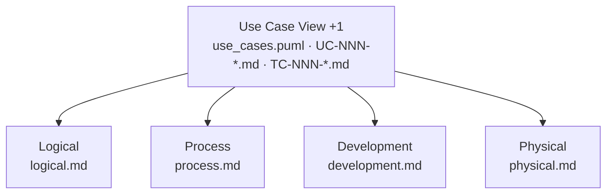
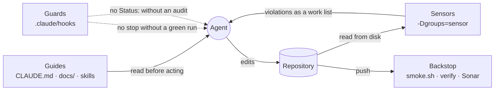

# Architecture

The architecture of AIUP PetClinic, written as the four views Philippe Kruchten
described in 1995 — plus the fifth that ties them together, but in reverse
order. Kruchten put the scenarios last, as a way to validate the other four
views. Here they come first: a use case is the unit of work, and the other four
views describe how a use case turns into code.

These documents are **context for an AI coding agent**, not a wiki page. That
sets three rules for them:

- **Text, not pictures.** Diagrams are Mermaid or PlantUML so an agent can read
  and change them. A PNG it can only ignore.
- **In the repository, not beside it.** Architecture and code are versioned
  together and change in the same pull request.
- **Short, not complete.** What is not written here gets invented; what is
  written at length gets skimmed.

## The five views



| View              | Question it answers                      | Where it lives                                                                                               |
|-------------------|------------------------------------------|--------------------------------------------------------------------------------------------------------------|
| **Use Case (+1)** | What should the system do, and for whom? | [`../use_cases.puml`](../use_cases.puml), [`../use_cases/`](../use_cases), [`../test_cases/`](../test_cases) |
| **Logical**       | Which business building blocks exist?    | [`logical.md`](logical.md) (+ [`../entity_model.md`](../entity_model.md))                                    |
| **Process**       | How does the system behave at runtime?   | [`process.md`](process.md)                                                                                   |
| **Development**   | How is the code organized?               | [`development.md`](development.md) + [`testing.md`](testing.md)                                              |
| **Physical**      | Where does the system run?               | [`physical.md`](physical.md)                                                                                 |

The Use Case View deliberately sits outside `architecture/`. It is the base the
architecture is built on, not a part of it.

## What an agent reads, and when

| Task                                         | Read first                                                             |
|----------------------------------------------|------------------------------------------------------------------------|
| Implement or change a use case               | its `UC-NNN-*.md`, then [`development.md`](development.md)             |
| Add an entity, attribute, or domain rule     | [`logical.md`](logical.md), [`../entity_model.md`](../entity_model.md) |
| Touch a save, a transaction, or a lookup     | [`process.md`](process.md)                                             |
| Change the build, the stack, or a convention | [`development.md`](development.md)                                     |
| Understand how the agent is kept on track    | this file — [*The harness*](#the-harness)                              |
| Add or change an agent guardrail / hook       | [`development.md`](development.md) — *Agent guardrails*                |
| Write or change a test                       | [`testing.md`](testing.md)                                             |
| Change how or where the app is run           | [`physical.md`](physical.md)                                           |
| Make a decision that contradicts a view      | [`adr/`](adr) — the same question has probably been answered once      |

`CLAUDE.md` in the repository root is the short form of all of this: the
entry point that says which document to open for which task.

## One home per fact

Every rule is stated **once**, in the view it belongs to. The code conventions
are not a separate guidelines folder any more — they *are* the Development View,
together with [`testing.md`](testing.md) for the test conventions. `CLAUDE.md`
is the index, not a second copy: it says which document to open, and holds only
what an agent needs in every single turn.

When a document would have to repeat something another one already says, it
links instead. Two documents stating the same rule are one edit away from
contradicting each other, and nobody can tell which one is the lie.

**No business logic lives in this folder.** A rule about owners, pets, or visits
belongs to the use case that needs it, or to
[`../business_rules.md`](../business_rules.md) when several use cases share it.
These documents say *where* a rule of a given kind is honoured — that is an
architectural decision and stays true however the rules change.

The views are also **prescriptive, not descriptive**: they say how a use case is
to be built, not what the code that exists happens to do. That is what lets the
same documents guide the first use case and the tenth — and why they name
patterns and use case ids rather than the classes of whichever use cases are
already implemented.

## Architecture Decision Records

The views describe the state. The ADRs describe why it is that state. An agent
facing the same question again reads them and decides the way the team decided,
instead of deciding anew.

ADR-001 to ADR-008 were written after the fact, reconstructing decisions the code
already embodies — like [`../vision.md`](../vision.md). From here on, a decision
that could have gone the other way gets its ADR when it is made.

| ADR                                                              | Decision                                                      |
|------------------------------------------------------------------|---------------------------------------------------------------|
| [ADR-001](adr/ADR-001-jooq-instead-of-jpa.md)                    | jOOQ with generated SQL instead of JPA/Hibernate              |
| [ADR-002](adr/ADR-002-vaadin-flow-server-side-ui.md)             | Vaadin Flow server-side UI instead of REST plus an SPA        |
| [ADR-003](adr/ADR-003-flyway-owns-the-schema.md)                 | Flyway owns the schema; jOOQ code generation runs against it  |
| [ADR-004](adr/ADR-004-package-by-feature-ui-domain.md)           | Package by feature with `ui` + `domain`, no service layer     |
| [ADR-005](adr/ADR-005-validation-in-the-form.md)                 | Validation lives in the Vaadin form, not in the domain record |
| [ADR-006](adr/ADR-006-two-test-layers-merged-coverage.md)        | Two test layers — browserless `*Test` and Playwright `*IT`    |
| [ADR-007](adr/ADR-007-traceability-sensors.md)                   | Specification traceability enforced by tests, not by review   |
| [ADR-008](adr/ADR-008-no-authentication.md)                      | No authentication; a trusted clinic network is assumed        |
| [ADR-009](adr/ADR-009-repository-is-the-transaction-boundary.md) | The repository is the transaction boundary                    |
| [ADR-010](adr/ADR-010-hooks-guard-the-session.md)                | Hooks guard the session; tests guard the repository            |
| [ADR-011](adr/ADR-011-guards-read-state-and-demand-evidence.md) | Guards read the repository's state and demand positive evidence |

## Traceability

```
Requirement → Use Case → View → Code → Test
```

Worked example, end to end:

`FR-015 Distinguishable Pet Names` → [`GR-006`](../business_rules.md#gr-006-unique-pet-name-per-owner)
→ `UC-007 BR-001` → Logical View (*a rule needing a lookup is honoured in the
view; one the data must never break is a constraint*) and Process View (*the two
are separate transactions, so the constraint is the backstop*) → the `pet`
module's form, queries, and migration → a test method annotated
`@UseCase(id = "UC-007", businessRules = "BR-001", scenario = "A1: Duplicate Pet Name for Owner")`.

Three of the arrows are enforced. `BusinessRuleTraceabilityTest` fails the
build when a use case and the catalogue disagree about a `GR-NNN`;
`UseCaseTraceabilityTest` and `TestCaseTraceabilityTest` fail it when an
annotation points at a use case, flow, or business rule that does not exist.

## The harness

An AI coding agent writes most of the code in this repository. What makes that
code trustworthy is not the model but the **harness** around it: everything that
tells the agent what to do before it acts, checks what it did afterwards, and
makes sure the check actually happened. None of it is new machinery. It is the
documents, tests and hooks described elsewhere, seen as one system. This
section says how the parts fit together and links to where each part is
specified.

### Four layers

| Layer          | Question it answers                              | Kind           | Parts                                                                                                                  | Binds                  |
|----------------|--------------------------------------------------|----------------|------------------------------------------------------------------------------------------------------------------------|------------------------|
| **Guides**     | What should the agent do, and how?               | before, prose  | `CLAUDE.md`, the specifications in `docs/`, the five views, the ADRs, the `aiup-*` skills                               | whoever reads them     |
| **Sensors**    | Does the repository still agree with the guides? | after, code    | `ArchitectureTest`, `TestLayerConventionsTest`, the three traceability tests; then the full suite and the quality gate | everyone, CI included  |
| **Guards**     | Did this session actually run the sensors?       | during, hooks  | the scripts in `.claude/hooks/`, wired up by `.claude/settings.json`                                                    | a Claude Code session  |
| **Backstop**   | Does it hold for everybody else?                 | after, CI      | `.github/workflows/build.yml`: `smoke.sh`, then the Maven build and SonarQube                                           | every push             |



**Guides** are feedforward. They shape what the agent writes before it writes
it, and they do so probabilistically: a rule in prose makes the right outcome
likelier, it does not prevent the wrong one. That is why they are written for an
agent (short, in text, one home per fact, see above) and why `CLAUDE.md` is an
index that names the document to open for each task rather than a copy of it.
The specifications say *what*: the use cases, the business rules, the entity
model. The views and ADRs say *how*. The skills (`aiup-vaadin-jooq:implement`,
`:browserless-test`, `:playwright-test`, `:coverage-check`) turn both into a
repeatable procedure, so the tenth use case gets built the way the first one was.

**Sensors** are feedback. The five sensor classes read the repository from disk
and compare it with the guides: ArchUnit checks the code against the
[Development View](development.md), and the traceability tests check the tests
against the use cases, test cases and business rules
([ADR-007](adr/ADR-007-traceability-sensors.md),
[`testing.md`](testing.md#the-traceability-sensors)). They are deterministic,
and they are built to be read by the agent. Every violation is listed at once
and names the section or heading it comes from, so a failure reads as a work
list, not a stack trace. Because they carry the JUnit tag `sensor`,
`./mvnw -q test -Dgroups=sensor` runs them in seconds and without Docker, which
is cheap enough to run every turn. The slower sensors sit behind them: the
browserless `*Test` and Playwright `*IT` suites, and the merged coverage that
the SonarQube gate reads.

**Guards** close the loop. A sensor can only catch drift once somebody runs it,
and whether it ran is a property of the session, not of the repository, so no
test can check it ([ADR-010](adr/ADR-010-hooks-guard-the-session.md)). The hooks
enforce exactly two things: a turn does not end while something under `src/`,
`docs/` or `pom.xml` changed after the last green sensor run, and a `Status:`
line does not claim coverage unless the `uc-coverage` agent audited that
specification after the code last changed. The individual hooks are listed in
[`development.md`](development.md) under *Agent guardrails*.

The **backstop** is CI. Hooks fire only inside a Claude Code session, so CI runs
`smoke.sh` (the hooks' own test) and then the full build for every push,
whoever or whatever made the change.

### One turn through the harness

Implementing a use case, say UC-007 *Add Pet to Owner*, goes through every layer:

1. **Session start.** `session-start.sh` records the commit and time the session
   started on and takes a first reading of every `Status:` line. Everything
   later is measured against that.
2. **Guides.** `CLAUDE.md` sends the agent to `UC-007-*.md`, from its `BR-001`
   to [`GR-006`](../business_rules.md#gr-006-unique-pet-name-per-owner), and to
   [`development.md`](development.md) before it touches `src/main/java/`. The
   `implement` skill turns them into a view, a form and repository queries.
3. **Sensors.** The agent runs `./mvnw -q test -Dgroups=sensor`. If a view declares
   `@Transactional`, `ArchitectureTest` fails and names the rule. If a test is
   annotated with a flow that the specification calls something else,
   `UseCaseTraceabilityTest` fails and names the heading. The agent fixes the
   code, not the check.
4. **Guard on stopping.** If the agent tries to end the turn without that run,
   or edits a file after it, `require-sensors.sh` refuses and names the command.
   `record-sensor-run.sh` counts a run only when every sensor's Surefire report
   is fresh and green. What the console printed does not matter.
5. **Guard on status.** To mark UC-007 `Done`, the agent first runs
   `coverage-check`. Its `uc-coverage` agent leaves a marker when it finishes.
   Without that marker, `guard-spec-status.sh` refuses the edit, and
   `check-spec-status.sh` reports a status that was changed some other way.
   From then on `Done` is an assertion: `UseCaseTraceabilityTest` demands a
   test for the main success scenario, every alternative flow and every
   business rule.
6. **Backstop.** On push, CI runs `smoke.sh`, then `./mvnw verify` with both
   test layers, then the quality gate on the merged coverage.

### The rules the harness is built on

- **Put each rule in the strongest layer that can hold it.** Judgment and
  intent go in a guide. Anything that can be checked by reading the repository
  becomes a test, because a test binds CI and every contributor. Only a rule
  about *what happened in the session* becomes a hook. The wrong test suffix
  was prose once; it is `TestLayerConventionsTest` now, not a hook.
- **A guard reads state, not tool calls.** A `Status:` line changed with `sed`
  counts the same as one changed with Edit. The hooks compare the files with
  what they saw last, not the call that changed them
  ([ADR-011](adr/ADR-011-guards-read-state-and-demand-evidence.md)).
- **Evidence is positive.** A sensor run counts because its reports say it ran
  and passed after the last change, never because nothing failed on screen. An
  audit counts because the auditing agent finished, never because the agent
  said so.
- **The honest fixes are always two:** write the missing code or test, or
  correct the specification or status. Weakening a sensor is not one of them.
- **Guards fail open.** A hook that cannot read its input exits quietly. A
  guardrail that breaks the session costs more than the drift it catches.
- **Cheap enough to run every turn.** A sensor nobody runs senses nothing. That
  is why the sensor tier runs apart from the Testcontainers suite.

### What the harness does not do

- **It does not judge quality.** The sensors check that code follows the
  conventions and that tests exist for every flow. They do not check that a
  test asserts the right thing. The coverage audit and code review still do
  that.
- **Hooks are local.** A contributor without Claude Code gets the guides, the
  sensors and CI, not the guards. That is why the guards enforce as little as
  possible.
- **There is one deliberate escape.** After one blocked Stop, the second one is
  let through, so a session without a working build cannot loop forever. A turn
  that ends that way shows it in the transcript. `mvn clean` after a run removes
  the evidence, and the Stop hook asks for the run again.

### Changing the harness

| You change                                 | Also update                                         | Then run                            |
|--------------------------------------------|-----------------------------------------------------|-------------------------------------|
| a convention in a view                     | the matching rule in `ArchitectureTest`             | `./mvnw -q test -Dgroups=sensor`    |
| the specification format (`Status:`, ids)  | `SpecDocuments` and [`testing.md`](testing.md)       | `./mvnw -q test -Dgroups=sensor`    |
| a hook or `.claude/settings.json`          | the table in [`development.md`](development.md)     | `./.claude/hooks/smoke.sh`          |
| what a layer is responsible for            | an [ADR](adr)                                       | both                                |
